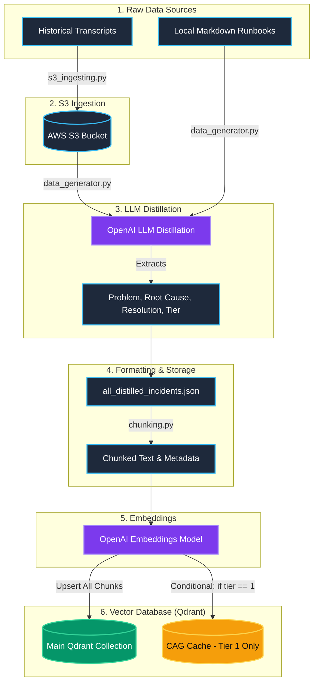
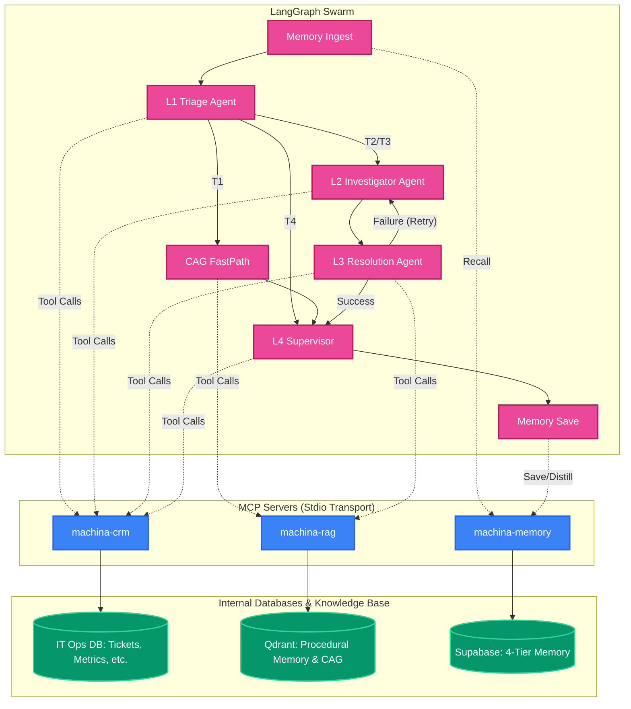

# 🌟 ZuuSwarm AI

ZuuSwarm AI is an advanced intelligent incident resolution platform. It leverages LLMs for distilling chaotic incident data and utilizes vector databases for high-speed semantic search and targeted context-aware retrieval.

## 🏗️ Architecture & Data Pipeline

The core data ingestion pipeline handles the flow from raw transcripts to structured embeddings stored in Qdrant, optimizing for both massive data retrieval and lightning-fast short-circuit caching for high-priority items.



### 🧠 Agent & MCP Architecture

This describes the execution flow during live incident resolution, utilizing our custom MCP servers to bridge the AI Swarm with the underlying databases.



### 🔄 Full Incident Resolution Workflow (L1 -> L4 + Voice Agent)

When a user reports an issue (e.g., *"Critical system failure! Website down!"*), the Swarm executes the following flow:

1. **Memory Ingest**:
   - Queries `machina-memory` (Short-Term/Long-Term memory) to fetch contextual history about the user and recent session turns.

2. **L1 Agent (Triage)**:
   - Classifies the problem into one of the 4 core ticket types:
     - **T1 (Access & Identity)**: High volume, low severity (e.g., VPN reset).
     - **T2 (Asset Provisioning)**: Medium volume, low severity (e.g., Broken laptop).
     - **T3 (Service Degradation)**: Low volume, medium severity (e.g., Slow API).
     - **T4 (Critical Outages)**: Rare, critical severity (e.g., Redis OOM).
   - Inserts the incident into the `live_tickets` table via CRM MCP.
   - **Routing Decision**: 
     - **T1**: Routes to `CAG FastPath` layer directly for an instant, clearance-checked response.
     - **T2 & T3**: Escalated to the lower-level agents (L2/L3).
     - **T4**: Routes straight to L4 Supervisor for real-time LiveKit Voice Agent escalation.

3. **L2 Agent (Investigator)**:
   - Utilizes Observability MCP tools (`get_asset_health`, `check_service_status`).
   - Analyzes metrics (CPU, memory, load) to identify anomalies.
   - Outputs an investigation summary for L3.

4. **L3 Agent (Resolver)**:
   - Uses `check_incident_history` to find SQL-based historical fixes.
   - Retrieves relevant runbooks from Qdrant via `machina-rag`.
   - Synthesizes findings and uses `perform_system_action` to execute the fix.
   - **Intelligent Retry**: If the action fails, L3 explicitly signals a failure, which conditionally loops back to L2 with context to try a new investigation strategy (max 3 retries).

5. **L4 Agent (Supervisor/Finalizer)**:
   - Validates fixes applied by L3 or CAG.
   - Uses `update_ticket` to mark the ticket as resolved/closed with detailed resolution notes.
   - Generates a comprehensive technical debrief for the user.

6. **Memory Save**:
   - Saves the final user/assistant exchange to Short-Term Memory.
   - Conditionally triggers Long-Term Memory distillation (saving semantic facts) and stores full Episodic memories of the session.

#### 🚨 T4 Deep Dive: Critical Incident Workflow (Voice Escalation)
For **T4 (Critical Outage)** scenarios like a total system crash, the Swarm executes a specialized high-priority flow:
- **Trigger & Alert (L1)**: Logs the critical ticket and immediately triggers the **LiveKit Voice Agent** to call a human DevOps engineer for real-time awareness.
- **Monitoring & Oversight (L4)**: The L4 Supervisor assumes active oversight (Monitored State) to coordinate the resolution.
- **Root Cause Analysis (L2)**: Rapidly pulls CPU/RAM/Load metrics via the Observability MCP to pinpoint the failure point.
- **Resolution Strategy (L3)**: Cross-references Qdrant runbooks with `incident_history` and executes the emergency fix (e.g., restarting Redis) via the Action MCP.
- **Final Verification (L4)**: Verifies system stability post-fix and closes the ticket.

## 🚀 Pipeline Execution Steps

1. **S3 Upload (`s3_ingesting.py`)**: Validates raw JSON incident transcripts and securely uploads them to AWS S3.
2. **LLM Distillation (`data_generator.py`)**: Retrieves documents from S3 and local Markdown runbooks, piping them into an OpenAI model to extract the core `problem`, `root_cause`, `resolution`, and priority `tier`.
3. **Data Combination**: Extracted data from all sources is unified and backed up locally as `all_distilled_incidents.json`.
4. **Chunking (`chunking.py`)**: Takes the structured dictionaries and formats them into clean, standardized strings optimized for dense vector embeddings.
5. **Embeddings Generation**: The text chunks are processed through an embedding provider (e.g., `text-embedding-3-small`) to generate dense semantic vectors.
6. **Main Collection Upsert (`qdrant_client.py`)**: All vector embeddings and metadata are upserted into the primary Qdrant collection.
7. **CAG Cache Injection**: High-priority incidents (Tier 1) are specifically filtered and injected into the specialized `CAG Cache` collection to dramatically speed up retrieval for the L1 System Header prompt.

## 🛠️ Usage

To run the complete end-to-end data ingestion pipeline:

```bash
python src/services/ingest_service/pipeline.py
```

## 🤖 Model Context Protocol (MCP) Integration

ZuuSwarm AI is built to be modular and accessible by any MCP-compliant client (LangGraph agents, Claude Desktop, Cursor, etc.). We expose our core capabilities as independent MCP servers communicating over `stdio`:

- **`machina-crm`**: IT Operations CRM. Exposes tools for ticketing (`create_ticket`, `update_ticket`), observability (`get_asset_health`, `check_service_status`), and system actions (`check_incident_history`, `perform_system_action`).
- **`machina-rag`**: Internal knowledge base retrieval. Exposes the CAG + CRAG pipeline (`rag_search`, `rag_cache_stats`).
- **`machina-cag`**: Direct access to the Qdrant-backed semantic cache (`cag_get`, `cag_set`, `cag_clear`).
- **`machina-memory`**: 4-tier persistent semantic memory. Allows agents to seamlessly recall recent conversation turns and store/query long-term facts (`recall_context`, `add_turn`, `store_fact`, `search_facts`).
- **`machina-web`** & **`machina-crawler`**: Web search and asynchronous web crawling tools.

### Inspecting MCP Servers
You can run and test any server interactively using the official MCP Inspector:
```bash
npx @modelcontextprotocol/inspector python -m mcp_servers.crm_server
```

## 🚀 What's Next (Hackathon Action Plan)

Based on the Zuu Crew AI challenge, the following critical milestones have been achieved / are up next:

### ✅ Completed
1. **Multi-Agent Swarm (LangGraph)**: Built the L1/L2/L3 agent architecture to automatically triage tickets, investigate using MCP logs/metrics, and retrieve runbooks via RAG.
2. **End-to-End Bug Fixes & Optimization**:
   - Fixed L3/L4 agent tool parameter mismatches to ensure Pydantic schema validation passes flawlessly.
   - Implemented an intelligent retry loop (L3 -> L2) with failure-context injection so agents don't blindly repeat failed steps.
   - Forced technical debriefs on final L4 supervisor outputs instead of generic "ticket closed" messages.
   - Overhauled system logging with rich, emoji-prefixed `infrastructure.log` integrations to trace MCP calls and routing latency.
   - Fixed SQL clearance checks in the testing suite by mapping to authorized Level 5 DevOps leads (`EMP-0044`).

### 🚧 Up Next
1. **Voice Escalation (LiveKit)**: Implement real-time voice escalations for Type 4 (Critical Outage) scenarios (e.g., verifying DevOps clearance before mock restarting a Redis OOM issue).
2. **Full Observability**: Integrate Langfuse to track, trace, and monitor the entire multi-agent swarm's execution paths and token usage.
