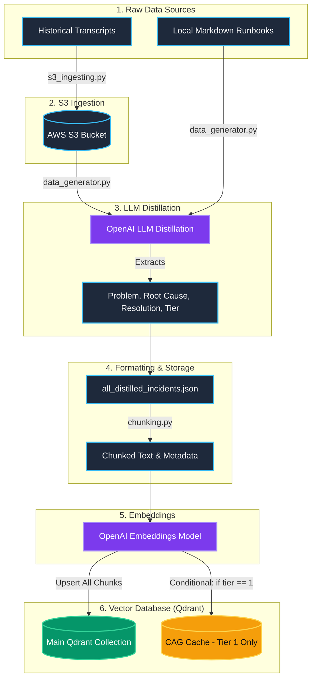

# 🌟 ZuuSwarm AI

ZuuSwarm AI is an advanced intelligent incident resolution platform. It leverages LLMs for distilling chaotic incident data and utilizes vector databases for high-speed semantic search and targeted context-aware retrieval.

## 🏗️ Architecture & Data Pipeline

The core data ingestion pipeline handles the flow from raw transcripts to structured embeddings stored in Qdrant, optimizing for both massive data retrieval and lightning-fast short-circuit caching for high-priority items.



## 🚀 Pipeline Execution Steps

1. **S3 Upload (`s3_ingesting.py`)**: Validates raw JSON incident transcripts and securely uploads them to AWS S3.
2. **LLM Distillation (`data_generator.py`)**: Retrieves documents from S3 and local Markdown runbooks, piping them into an OpenAI model to extract the core `problem`, `root_cause`, `resolution`, and priority `tier`.
3. **Data Combination**: Extracted data from all sources is unified and backed up locally as `all_distilled_incidents.json`.
4. **Chunking (`chunking.py`)**: Takes the structured dictionaries and formats them into clean, standardized strings optimized for dense vector embeddings.
5. **Embeddings Generation**: The text chunks are processed through an embedding provider (e.g., `text-embedding-3-small`) to generate dense semantic vectors.
6. **Main Collection Upsert (`qdrant_client.py`)**: All vector embeddings and metadata are upserted into the primary Qdrant collection.
7. **CAG Cache Injection**: High-priority incidents (Tier 1) are specifically filtered and injected into the specialized `CAG Cache` collection to dramatically speed up retrieval for the L1 System Header prompt.

## 🛠️ Usage

To run the complete end-to-end data ingestion pipeline:

```bash
python src/services/ingest_service/pipeline.py
```
